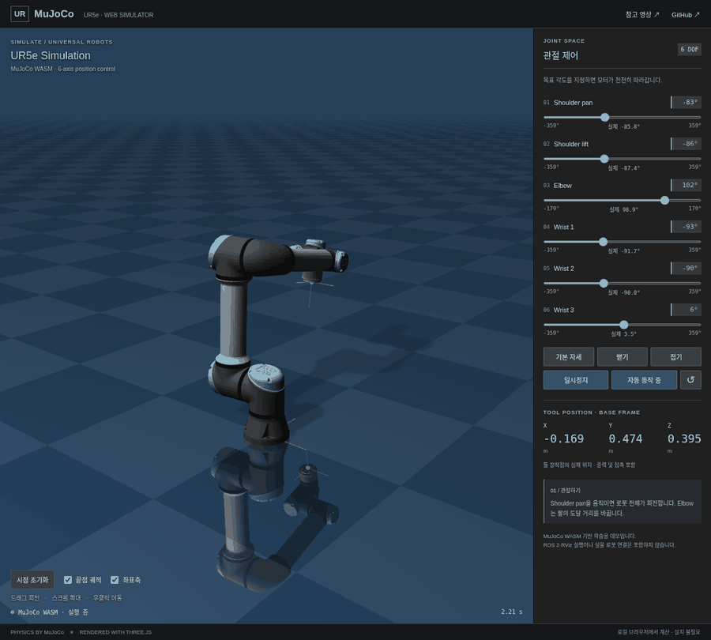

# Dual UR5e · MuJoCo WASM Robot Lab

**설치 없이 브라우저에서 조작하는 UR5e 양팔 로봇 물리 시뮬레이터.**

### [▶ 데모 실행하기](https://jaewook6488.github.io/ur-mujoco-wasm/)

[](https://jaewook6488.github.io/ur-mujoco-wasm/)

README의 위 이미지는 **실제 데모에서 캡처한 애니메이션**입니다. 클릭하면 GitHub Pages에서 **MuJoCo WebAssembly 엔진**을 실행합니다. 현재 버전은 GitHub README 내부에서 WASM을 직접 실행하는 구현이 아닙니다.

## 할 수 있는 것

- **양팔 12축 관절 제어**: 목표 각도를 움직이면 위치 제어 모터가 따라갑니다. 왼팔·오른팔을 선택해 목표와 실제 각도를 함께 표시합니다. 양팔에 같은 목표를 적용할 수도 있습니다.
- **독립 그리퍼 제어**: 양팔에 단순화한 평행 그리퍼가 있으며, 열림 폭을 조절합니다. 작업대와 자유롭게 움직이는 블록에는 물리 접촉이 적용됩니다.
- **자세 프리셋**: 기본 자세, 뻗기, 접기.
- **자동 동작 / 일시정지 / 초기화**: 물리 시뮬레이션을 관찰하고 정지할 수 있습니다.
- **끝점 좌표와 궤적**: 각 그리퍼 중심의 월드 XYZ 위치(m), 양팔 끝점 간 거리, 파랑·주황 궤적, 좌표축을 표시합니다.
- **시점 조작**: 드래그로 회전, 휠로 확대, 우클릭으로 이동합니다.
- **MuJoCo WASM 뷰어 스타일**: 청회색 배경, 반사되는 체크무늬 바닥, 원본 메시 법선과 재질, 어두운 조작 패널.
- 모바일 화면에 대응하며, 물리 계산은 사용자의 브라우저에서 수행합니다.

- **실시간 6축 그래프 3개**: 선택한 팔의 실제 위치(°), 속도(°/s), 액추에이터 관절 토크(N·m)를 현재 기준 최근 5초(-5초~0초)를 표시합니다. 양팔 기록은 독립적으로 유지되며 일시정지·초기화와 연동됩니다. 전류 환산은 포함하지 않습니다.

- **마우스 외력**: Ctrl + 왼쪽 드래그 또는 `힘 가하기` 모드로 블록·로봇 링크를 당길 수 있습니다. 노란 화살표와 N 단위 힘을 표시하고, 마우스를 놓거나 창을 벗어나면 해제합니다. ROS 연결 상태에서도 작동합니다.

## 구현

```text
관절 슬라이더 → 속도가 제한된 모터 목표값
             → MuJoCo WASM · 0.002초 간격 물리 계산
             → 관절 / 바디 / 툴 위치
             → Three.js 렌더링 + 실시간 수치 표시
```

| 구성 | 사용한 구현 |
| --- | --- |
| 물리 엔진 | Google DeepMind 공식 `@mujoco/mujoco` 3.15.0, 단일 스레드 WASM |
| 로봇 모델 | MuJoCo Menagerie UR5e × 2 · 원본 메시/관성/모터 + 단순 평행 그리퍼 |
| 렌더링 | Three.js, WebGL |
| 배포 | GitHub Actions → GitHub Pages |

중력과 접촉이 포함된 물리 모델입니다. [ALOHA](https://aloha-unleashed.github.io/)의 양팔 작업 공간에서 착안했으며, ALOHA 실물의 기구·게인·학습 정책을 재현한 모델은 아닙니다. UR5e 팔의 원본 관성·위치 제어기에 자체 제작한 그리퍼와 작업대를 추가했습니다. 그리퍼 질량, 마찰, 게인은 실물 식별값이 아닙니다.

끝점은 각 그리퍼 손가락 사이의 중심을 뜻하며 공통 월드 좌표로 표시합니다. 각 그리퍼에는 두 슬라이드 관절과 결합 제약이 있고, 하나의 위치 액추에이터로 구동합니다. 블록은 자유 물체입니다. 자동 동작은 미리 정한 관절 궤적이며, 자동 집기·충돌 회피·IK·모방학습은 포함하지 않습니다. 임의의 목표는 팔이나 작업대와의 충돌 때문에 도달하지 못할 수 있습니다.

원본 영상은 [Kevin Wood의 UR Robot ROS 2 / RViz 설치 안내](https://www.youtube.com/watch?v=lLF6I9Iduo8)입니다. 이 저장소는 UR 로봇의 동작을 설치 없이 살펴보기 위한 별도 웹 데모이며, ROS 2 또는 RViz 자체를 WASM으로 포팅한 것은 아닙니다. 실물 로봇에 명령을 보내지 않습니다.

## 로컬 실행

Node.js 22+, npm, Python 3가 필요합니다.

```bash
git clone https://github.com/JAEWOOK6488/ur-mujoco-wasm.git
cd ur-mujoco-wasm
npm ci
npm test
npm run build
npm run serve
```

브라우저에서 <http://127.0.0.1:8124>를 엽니다. `file://`로 직접 열지 말고 HTTP 서버를 사용하세요. 양팔 모델을 다시 생성하려면 `python3 scripts/bimanual-model.py`를 실행합니다. 메시 자산은 두 팔이 공유합니다. 첫 로딩에는 모델 메시 약 30 MB와 엔진 약 10 MB(압축 전)를 가져옵니다.

## 검증

`npm test`는 실제 WASM 엔진으로 다음을 확인합니다.

- 양팔 12축 + 2개 그리퍼 액추에이터 로딩, 중력 아래 자세 유지
- 양팔의 독립적인 자세 추종, 끝점 이동, 그리퍼 닫힘과 손가락 결합
- 목표값 제한과 초기화
- 20초 양팔 자동 궤적에서 수치 발산 여부, 블록과 작업대 접촉

브라우저 검증은 서버 실행 후 `node scripts/browser-check.mjs`로 수행합니다. Chrome 경로는 `CHROME_PATH` 환경변수로 지정할 수 있습니다. 관절 조작, 일시정지, 프리셋, 자동 동작, 초기화, 모바일 가로 넘침, JavaScript 오류를 확인합니다.

## 파일 안내

| 파일 | 역할 |
| --- | --- |
| `src/simulation.js` | WASM 로딩, 모델 마운트, 관절 목표, 물리 스텝 |
| `src/scene.js` | MuJoCo 형상 → Three.js 메시, 좌표계 변환 |
| `src/main.js` | UI, 카메라, 시뮬레이션 루프, 궤적 |
| `public/model/` | 출처와 라이선스를 포함한 고정 버전 UR5e 모델 |
| `scripts/bimanual-model.py` | 원본 UR5e에서 양팔·그리퍼·작업대 MJCF 생성 |
| `scripts/vendor-model.py` | 고정된 upstream revision에서 모델 다시 가져오기 |
| `.github/workflows/pages.yml` | 물리 검증, 빌드, 자동 배포 |

## 라이선스와 출처

앱 코드는 MIT, UR5e 모델은 BSD-3-Clause, MuJoCo는 Apache-2.0입니다. [NOTICE](NOTICE)와 [모델 원본 라이선스](public/model/LICENSE)를 확인하세요. 모델 출처는 [MuJoCo Menagerie](https://github.com/google-deepmind/mujoco_menagerie/tree/0059d4335f8156206f63a35662313385f7ad6d74/universal_robots_ur5e)입니다.

## ROS 2 연동

ROS 2 궤적 명령으로 웹 MuJoCo를 움직이고 실제 관절 상태를 RViz에 전달하는 로컬 모드를 추가했습니다. [실행 방법](ros/README.md)을 참고하세요. GitHub Pages는 독립 데모이며, ROS 연동은 로컬 브리지 주소에서 실행합니다.
